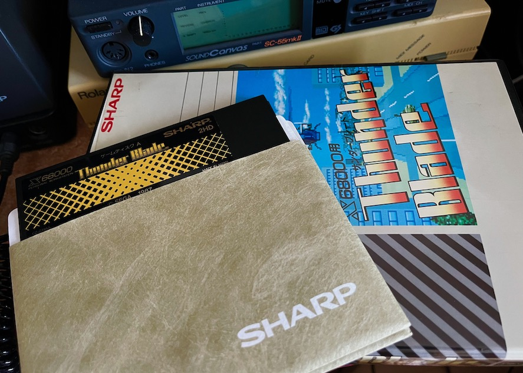

# thunderblade-x68k

X68000版 Thunder Blade に関する覚書

---

## はじめに

この覚書は自分のお気に入りのX68000用ゲームソフトの一つである、Thunder Blade (SEGA/SPS) に関するメモです。

以下について記述しています。

* MIDI
* SCSIハードディスクインストール

---

## MIDI

このソフトはMIDIボードを拡張スロットに装着していると、外部MIDI音源(MT-32,CM-64などのRoland LA音源)を鳴らすことができます。

タイトル画面でF5キーを押すと切り替えのメニューに入ることができます。

ただし、個人的にはこのゲームの場合は内蔵音源の方が遥かに良いので、INTERNAL固定ですw

---

## SCSIハードディスクインストール

本ソフトは標準ではハードディスクインストールに対応していません。そのため起動やステージ間でのロードにとても時間がかかります。

非公式ですが、自分なりのハードディスクインストールの方法です。

プロテクトを外す必要はありません。

1. Human68k 2.02(または2.03) と純正 SCSIDRV.SYS が入ったシステムディスクを用意する。(例えばGRADIUS IIのDiskAなどでokです)
2. ブランクディスクを用意し、FORMAT.Xでフォーマットする。以下FDドライブがA:とB:であると仮定する。
3. A:に Human68k v2のシステムディスク、B:にフォーマット済みディスクが入った状態で、

        A:
        SYS B:

としてブランクディスクに HUMAN.SYS を書き込む。

4. SCSIDRV.SYS をB:にコピーする。
5. 以下のファイルを Human68k v2のシステムディスクからB:にコピーする。無い場合は無償公開されている Human68k 3.02のシステムディスクからでも良い。

        COMMAND.X
        DRIVE.X
        SUBST.X

6. A:を Thunder Blade DiskA に入れ替え、HUMAN.SYS以外のすべてのファイルをB:にコピーする。
7. B:のCONFIG.SYSを以下のように変更する。

        FILES   = 15
        BUFFERS = 20
        DEVICE  = SCSIDRV.SYS /ID0
        DEVICE  = MC.SYS
        SHELL   = COMMAND.X THB.BAT

8. B:のルートにTHB.BATを以下の内容で作成する。

        ECHO OFF

        SUBST P: C:\GAMES\THUNDERBLADE\DISKAC
        SUBST Q: C:\GAMES\THUNDERBLADE\DISKB

        DRIVE A: P: >NUL
        DRIVE B: Q: >NUL

        A:

        ECHO Thunder Blade のマスターディスクAをドライブ0に入れてください
        PAUSE

        THB.X -pa:;b:

9. 以降起動する時は新しく作成したこのディスクから起動する。

10. 起動SCSIハードディスクドライブに \GAMES\THUNDERBLADE のディレクトリを作り、その中にDISKACディレクトリとDISKBディレクトリを作る。
11. DISKACディレクトリに Thunder Blade DiskA と DiskC の内容を DISKCOPY.X を使ってすべてコピーする。
12. DISKBディレクトリに Thunder Blade DiskB の内容を DISKCOPY.X を使ってすべてコピーする。
13. 途中でマスターディスクを求められるので、マスターディスクと入れ替えることでゲームが起動する。DiskB,Cは使わない。

なお、Human68k 3.02ではサウンドドライバが動作しませんので起動できません。

---

## 更新履歴

2023.09.13 ... 初版
